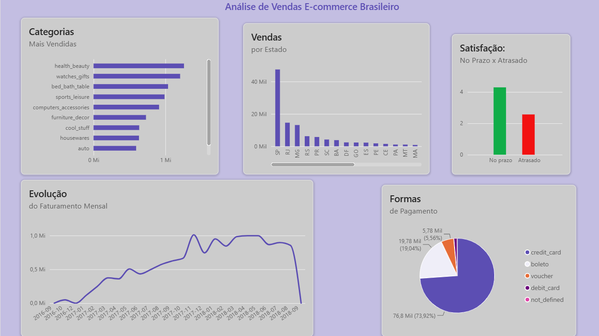

# Análise de Vendas — E-commerce Brasileiro (Olist)

Análise exploratória de dados de vendas de um marketplace brasileiro, utilizando **SQL Server** para extração e tratamento dos dados, e **Power BI** para visualização dos resultados.

## 📊 Sobre o projeto

Este projeto tem como objetivo responder a 5 perguntas de negócio sobre o comportamento de vendas, clientes e operação logística de um e-commerce, a partir do dataset público **[Brazilian E-Commerce Public Dataset by Olist](https://www.kaggle.com/datasets/olistbr/brazilian-ecommerce)**, disponível no Kaggle.

O dataset contém informações reais (anonimizadas) de aproximadamente 100 mil pedidos realizados entre 2016 e 2018 em múltiplos marketplaces no Brasil, incluindo dados de clientes, produtos, pagamentos, avaliações e vendedores.

## 🎯 Perguntas de negócio respondidas

1. Como o faturamento evoluiu mês a mês ao longo do período analisado?
2. Quais categorias de produto mais vendem, em faturamento?
3. Como os clientes estão distribuídos geograficamente entre os estados?
4. Pedidos entregues com atraso recebem avaliações piores?
5. Qual é a forma de pagamento mais utilizada pelos clientes?

## 🔍 Principais insights

- **Crescimento consistente:** o faturamento cresceu de forma constante desde o lançamento da plataforma (set/2016) até meados de 2018.
- **Health & Beauty lidera em faturamento** (R$ 1,26M), mesmo não sendo a categoria com maior volume de itens vendidos — indicando um ticket médio mais alto nesse segmento.
- **São Paulo concentra a maior parte das vendas**, com 41.375 pedidos — mais que o triplo do segundo colocado (Rio de Janeiro).
- **Atraso na entrega impacta fortemente a satisfação do cliente:** pedidos entregues no prazo têm nota média de avaliação **4,29**, enquanto pedidos atrasados caem para **2,57** — uma queda de quase 2 pontos em uma escala de 5.
- **Cartão de crédito é a forma de pagamento dominante**, usado em 73,9% das transações, e também com o maior ticket médio (R$ 163,32).

## 🛠️ Ferramentas utilizadas

- **SQL Server (SSMS)** — importação, tratamento e consulta dos dados
- **Power BI Desktop** — modelagem de dados e construção do dashboard

## 📁 Estrutura do repositório

- queries/analise_vendas.sql — As 5 queries SQL utilizadas na análise
- dashboard/analise_vendas.pbix — Arquivo do Power BI
- images/analise-vendas.png — Print do dashboard final
- README.md

## 📈 Dashboard

## 🗂️ Sobre os dados

O dataset foi importado para um banco relacional no SQL Server, com 8 tabelas principais (`orders`, `order_items`, `order_payments`, `order_reviews`, `products`, `customers`, `sellers`, `category_translation`), conectadas por meio de chaves como `order_id`, `customer_id` e `product_id`.

---

**Autor:** Joziel de Jesus Souza
[LinkedIn](https://linkedin.com/in/joziel-de-jesus)
